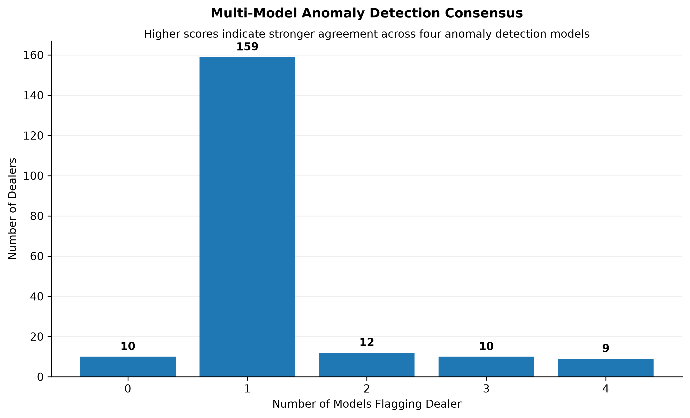
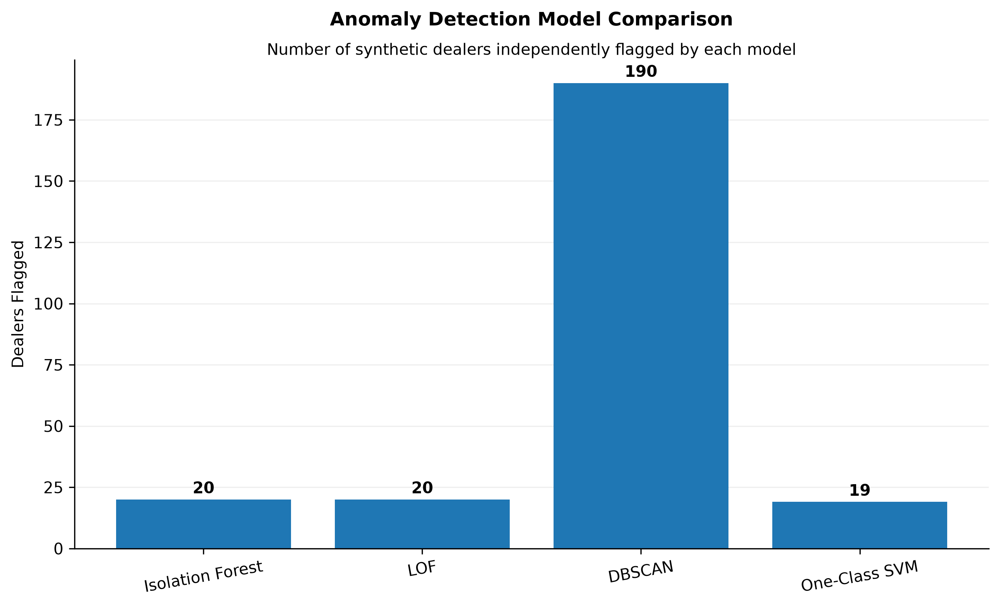
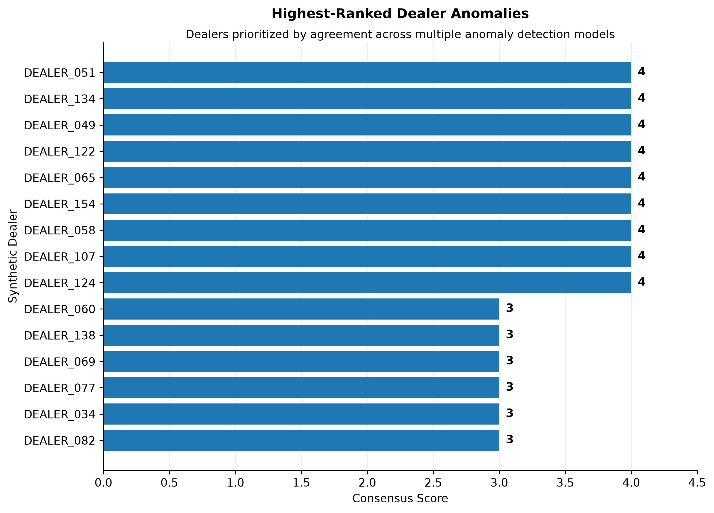

# Dealer Warranty Anomaly Detection Framework

An end-to-end unsupervised machine learning framework for identifying unusual dealer warranty behavior using multiple anomaly detection algorithms and model consensus scoring.

The project combines **Isolation Forest, Local Outlier Factor (LOF), DBSCAN, and One-Class SVM** to identify dealers exhibiting abnormal warranty cost, reliability, claims-processing, and operational patterns.

> **Portfolio Note:** The original analysis was developed using warranty claims data in an internship environment. The public version of this repository uses **synthetic, non-proprietary data** and sanitized feature names so the methodology can be demonstrated without exposing confidential company information.

---

## Project Overview

Warranty organizations process large volumes of claims across dealer networks. Manually identifying dealers with unusual behavior can be difficult because anomalies may appear across several dimensions simultaneously.

The objective of this project was to answer:

> **Which dealers exhibit unusual warranty behavior, and which anomalies are strong enough to prioritize for further investigation?**

Rather than relying on a single anomaly detection algorithm, this project uses four unsupervised machine learning models and combines their predictions through a **multi-model consensus framework**.

The resulting pipeline produces:

- Dealer-level anomaly flags
- Model-specific anomaly results
- Cross-model consensus scores
- Dealer risk tiers
- Ranked dealer watchlists
- Period-over-period anomaly comparisons
- Visual reporting for model interpretation

---

## Business Problem

Traditional warranty monitoring can rely heavily on fixed thresholds and manual investigation.

However, unusual dealer behavior may involve combinations of:

- High warranty cost
- High claim frequency
- Early component failures
- Repeat claims
- Long claims-processing times
- Unusual contract-code behavior
- Abnormal operational patterns

A dealer may not exceed any single business threshold while still exhibiting a combination of behaviors that makes it statistically unusual.

This project applies **unsupervised anomaly detection** to identify those multidimensional patterns.

---

## Dataset

The original project analysis included:

- **26,000+ warranty claims**
- **584 dealers**
- **Q1–Q2 2026 analysis**


Because the original data is proprietary, it is **not included in this repository**.

Instead, the repository contains a synthetic dealer-level dataset that reproduces the structure required to demonstrate the anomaly detection pipeline.

### Public Sample Data

The synthetic dataset is located at:

```text
data/sample_dataset.xlsx
```

Synthetic data can also be regenerated using:

```bash
python scripts/generate_sample_data.py
```

The generator creates dealer-level records with multiple analysis periods and intentionally introduces unusual observations so the anomaly detection models have meaningful patterns to identify.

---

## Feature Engineering

Dealer-level features were engineered from warranty claim activity.

### Warranty Cost Metrics

- `CostPerVIN`
- `AvgCostPerClaim`
- `ClaimsPerVIN`

### Reliability Metrics

- `AvgMilesToFailure`
- `AvgDaysToFailure`
- `RepeatClaimPct`
- `RepeatVINPct`

### Claims Processing Metrics

- `FailuretoAcceptedDays`
- `AccepttoApprovedDays`
- `AvgClaimTouches`

### Warranty Complexity Metrics

- `ContractCodeCount`
- `ClaimsPerContractCode`
- `UnknownPct`

These features convert raw claims activity into dealer-level behavioral profiles that can be analyzed by unsupervised machine learning models.

---

## Machine Learning Models

Four anomaly detection algorithms were used because each identifies unusual observations differently.

### 1. Isolation Forest

Isolation Forest identifies observations that can be isolated from the rest of the dataset using fewer random partitions.

In this project, it is used to identify dealers whose overall feature profiles differ significantly from the broader dealer population.

### 2. Local Outlier Factor (LOF)

LOF compares the local density surrounding each observation with the density surrounding neighboring observations.

This allows the framework to identify dealers that behave unusually relative to dealers with otherwise similar characteristics.

### 3. DBSCAN

DBSCAN is a density-based clustering algorithm.

Dealers that do not belong to a sufficiently dense cluster are labeled as noise and treated as potential anomalies.

This provides a clustering-based perspective that differs from the other anomaly detection methods.

### 4. One-Class SVM

One-Class SVM learns a boundary representing the normal dealer population.

Dealers falling outside the learned boundary are identified as potential anomalies.

---

## Multi-Model Consensus Framework

Individual anomaly detection models can disagree because they use different definitions of abnormal behavior.

Instead of relying on one model, this project combines all four model outputs.

For each dealer:

```text
Consensus Score =
Isolation Forest Flag
+ LOF Flag
+ DBSCAN Flag
+ One-Class SVM Flag
```

This produces a score from **0 to 4**.

| Consensus Score | Interpretation |
|---:|---|
| 0 | No models flagged the dealer |
| 1 | Weak anomaly signal |
| 2 | Moderate anomaly signal |
| 3 | Strong anomaly signal |
| 4 | All four models agree |

Higher consensus scores indicate stronger agreement across independent anomaly detection methods.

This helps prioritize dealers for further investigation rather than treating every model flag equally.

---

## Pipeline Architecture

The public implementation separates data processing, modeling, consensus scoring, execution, and visualization.

```text
Synthetic / Sanitized Data
          |
          v
    Data Processing
          |
          v
   Feature Scaling
          |
          v
+---------------------------+
|  Isolation Forest         |
|  Local Outlier Factor     |
|  DBSCAN                   |
|  One-Class SVM            |
+---------------------------+
          |
          v
  Model Anomaly Flags
          |
          v
   Consensus Scoring
          |
          v
 Dealer Risk Prioritization
          |
          v
 Results + Visualizations
```

---

## Results

The pipeline was successfully executed against the synthetic dealer dataset.

Example consensus distribution:

| Consensus Score | Dealers |
|---:|---:|
| 0 | 10 |
| 1 | 159 |
| 2 | 12 |
| 3 | 10 |
| 4 | 9 |

The strongest anomaly candidates are dealers receiving high consensus scores because multiple independent models identified unusual behavior.

The complete synthetic pipeline output is available at:

```text
results/dealer_anomaly_results.csv
```

---

## Results Visualization

### Multi-Model Consensus Distribution



This visualization shows how dealers are distributed across consensus scores. Dealers receiving scores of **3 or 4** represent stronger multi-model anomaly signals.

### Model Comparison



This visualization compares the number of dealers identified as anomalous by each machine learning algorithm.

Because the algorithms use different mathematical definitions of abnormal behavior, differences between model outputs are expected.

### Highest-Risk Dealers



This visualization highlights dealers receiving the strongest consensus signals and provides a prioritized watchlist for further analysis.

---

## Period-Over-Period Analysis

The original analysis also compared dealer anomaly behavior across multiple periods.

Dealers were classified into categories such as:

| Status | Interpretation |
|---|---|
| **Persistent Anomaly** | Flagged in both periods |
| **Emerging Anomaly** | Normal previously, anomalous in the later period |
| **Improved** | Anomalous previously, normal in the later period |
| **Normal** | Not flagged across either period |

This allows the framework to move beyond static anomaly detection and evaluate how dealer behavior changes over time.

---

## Feature Difference Analysis

For model outputs such as DBSCAN, anomalous dealers were compared with the normal dealer population across individual features.

For each feature, the analysis compares:

```text
Average Feature Value — Anomalous Dealers

vs.

Average Feature Value — Normal Dealers
```

The absolute difference helps identify which variables most strongly distinguish the anomalous population.

This is used as an **interpretability analysis**, rather than native model feature importance.

---

## Key Analytical Findings

The original analysis identified several important anomaly drivers, including:

1. `AvgMilesToFailure`
2. `CostPerVIN`
3. `AvgCostPerClaim`
4. `FailuretoAcceptedDays`
5. `AccepttoApprovedDays`

The analysis suggested that unusual dealer behavior was not limited to warranty cost alone.

Reliability patterns and claims-processing behavior also contributed to dealer anomaly profiles, demonstrating the value of using multidimensional dealer features.

---

## Project Structure

```text
dealer-warranty-anomaly-detection/
│
├── data/
│   └── sample_dataset.xlsx
│
├── original_analysis/
│   ├── dbscan_analysis.py
│   ├── isolation_forest_analysis.py
│   ├── lof_analysis.py
│   └── one_class_svm_analysis.py
│
├── results/
│   ├── dealer_anomaly_results.csv
│   └── figures/
│       ├── consensus_distribution.png
│       ├── model_comparison.png
│       └── top_risk_dealers.png
│
├── scripts/
│   ├── generate_sample_data.py
│   ├── run_pipeline.py
│   └── create_visualizations.py
│
├── src/
│   ├── consensus.py
│   ├── data_processing.py
│   └── models.py
│
├── .gitignore
├── LICENSE
├── README.md
└── requirements.txt
```

---

## Original Analysis vs. Refactored Pipeline

This repository contains two representations of the project.

### `original_analysis/`

Contains sanitized versions of the model-specific analytical workflows used during the original project development.

These scripts preserve the exploratory analysis structure, including:

- Period-specific modeling
- Dealer anomaly ranking
- Period-over-period comparison
- Feature difference analysis
- Excel result exports

### `src/`

Contains the refactored and reusable machine learning components.

Instead of maintaining four repetitive standalone scripts, the models are implemented as reusable functions that can be called by the central pipeline.

This separation preserves the original analytical workflow while demonstrating how the project can be converted into a cleaner software architecture.

---

## Methodology

The project follows the **CRISP-DM** analytical framework.

### 1. Business Understanding

Define the warranty-monitoring problem and determine how anomaly detection could support dealer investigation.

### 2. Data Understanding

Explore warranty claims, dealer behavior, cost distributions, reliability patterns, and claims-processing characteristics.

### 3. Data Preparation

Clean the data, aggregate claims to dealer-level profiles, engineer analytical features, and standardize features for modeling.

### 4. Modeling

Apply:

- Isolation Forest
- Local Outlier Factor
- DBSCAN
- One-Class SVM

### 5. Evaluation

Compare model outputs, examine anomalous dealer characteristics, evaluate period-over-period behavior, and calculate multi-model consensus.

### 6. Deployment / Reporting

Convert model outputs into dealer rankings, watchlists, risk tiers, visualizations, and business-facing reporting.

---

## Installation

### 1. Clone the repository

```bash
git clone https://github.com/Yusufshireds26/dealer-warranty-anomaly-detection.git
```

### 2. Navigate into the project

```bash
cd dealer-warranty-anomaly-detection
```

### 3. Install dependencies

```bash
pip install -r requirements.txt
```

---

## Running the Project

### Step 1 — Generate synthetic data

```bash
python scripts/generate_sample_data.py
```

This creates:

```text
data/sample_dataset.xlsx
```

### Step 2 — Run the anomaly detection pipeline

```bash
python scripts/run_pipeline.py
```

This executes the four anomaly detection models, calculates consensus scores, and generates the dealer-level results.

Output:

```text
results/dealer_anomaly_results.csv
```

### Step 3 — Generate visualizations

```bash
python scripts/create_visualizations.py
```

This creates:

```text
results/figures/consensus_distribution.png
results/figures/model_comparison.png
results/figures/top_risk_dealers.png
```

---

## Technologies

**Programming & Data**

- Python
- Pandas
- NumPy

**Machine Learning**

- Scikit-learn
- Isolation Forest
- Local Outlier Factor
- DBSCAN
- One-Class SVM

**Data Processing & Reporting**

- StandardScaler
- Matplotlib
- OpenPyXL
- Excel

**Original Project Environment**

- SQL Server
- Python
- Excel
- Data visualization and business reporting

---

## Skills Demonstrated

This project demonstrates experience with:

- Unsupervised machine learning
- Anomaly detection
- Feature engineering
- Data cleaning and preprocessing
- Model comparison
- Model interpretability
- Consensus modeling
- Temporal anomaly analysis
- Python pipeline development
- Data visualization
- Business analytics
- Translating machine learning outputs into actionable risk prioritization

---

## Business Value

The framework demonstrates how machine learning can transform large volumes of warranty activity into a prioritized investigation workflow.

Instead of manually reviewing every dealer, analysts can use anomaly detection to:

- Identify statistically unusual dealer behavior
- Prioritize high-consensus anomalies
- Detect emerging behavioral changes
- Track persistent anomalies across periods
- Investigate the features contributing to unusual behavior
- Create data-driven dealer watchlists

The models are designed to support investigation and prioritization rather than automatically determine whether a dealer's behavior is improper.

---

## Data Privacy

No proprietary warranty claims, confidential dealer information, internal company identifiers, or production datasets are included in this repository.

The public dataset is **synthetically generated** for portfolio and demonstration purposes.

Feature names and identifiers used in the public pipeline have been generalized where necessary to protect confidential business information.

---

## License

This project is available under the MIT License.
